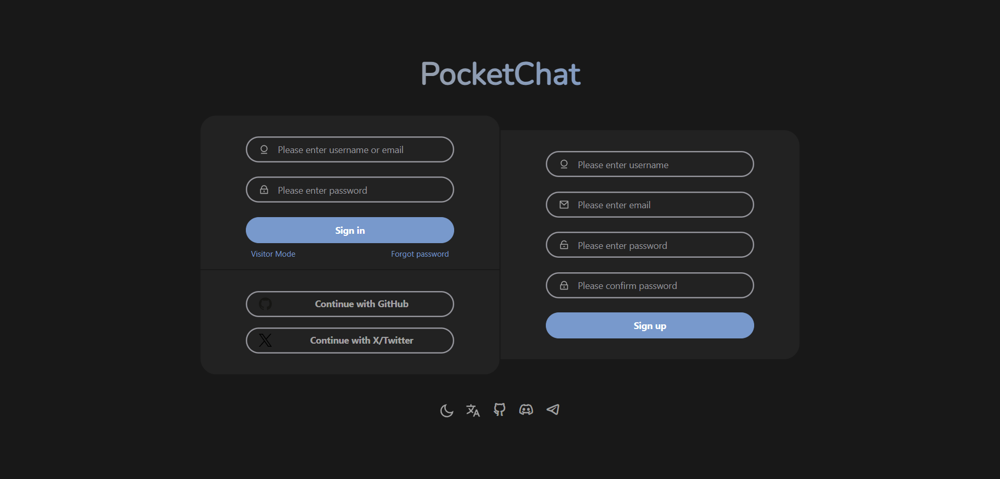
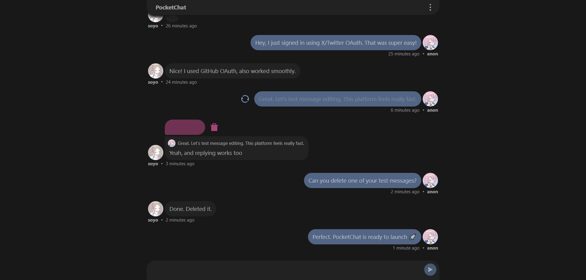
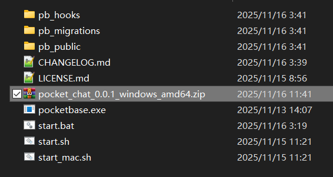
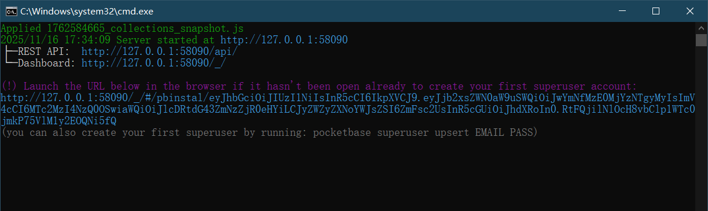
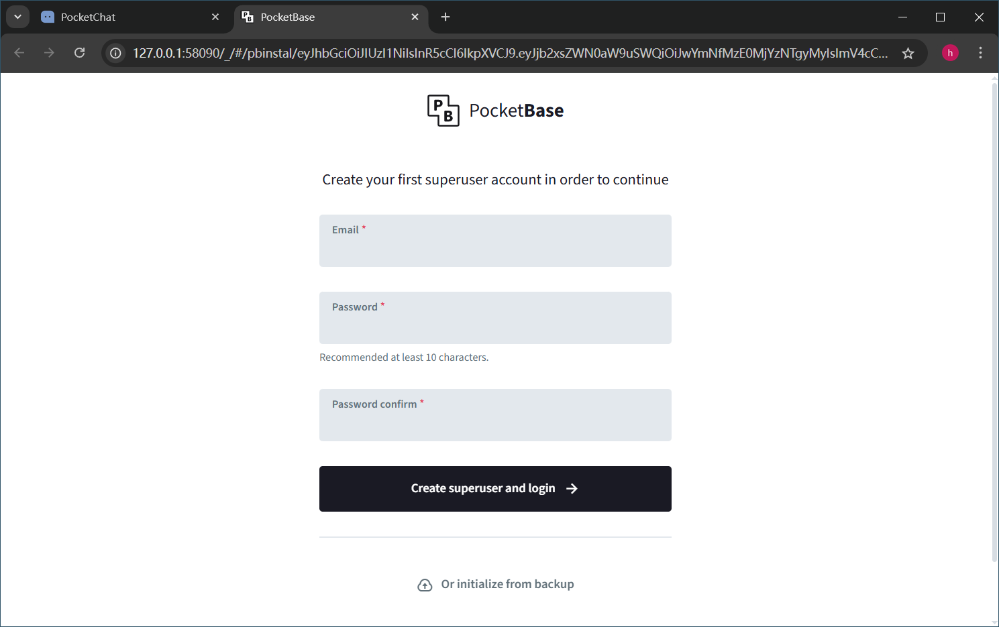
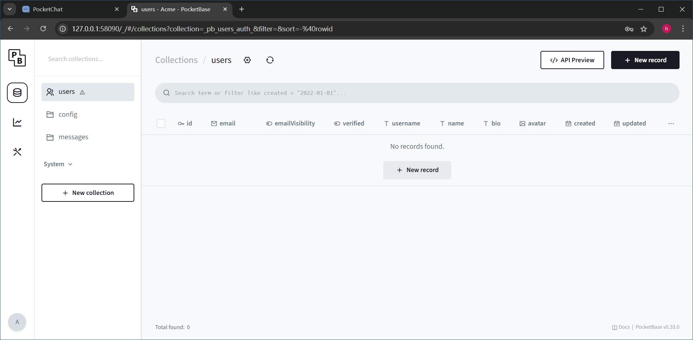
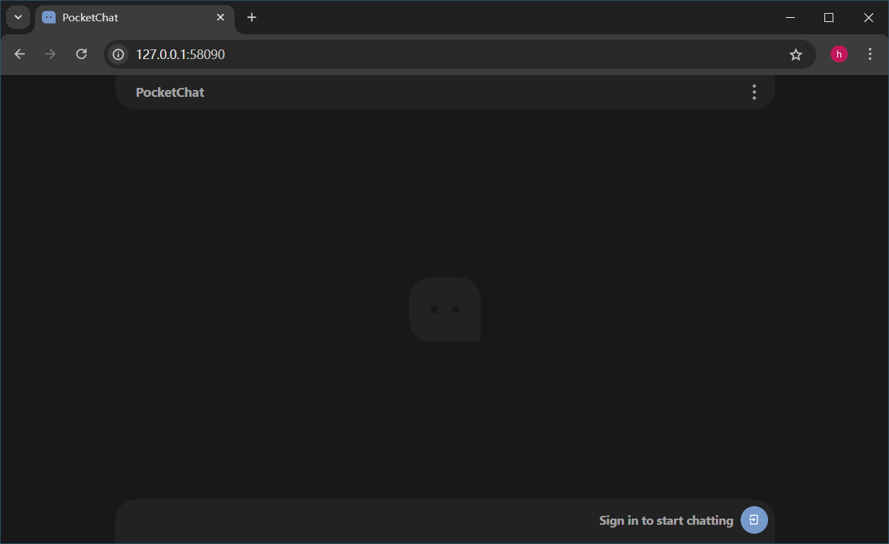

<div align="center">
  
</div>

<h1 align="center">
  PocketChat
</h1>

<p align="center">
  <!-- Vue.js -->
  
  <!-- TailwindCSS -->
  
  <!-- TanStack Query -->
  
  <!-- PocketBase -->
  
  </br>
  
  
  
</p>


<p align="center">
  English | <a href="./README_CN.md">简体中文</a>
</p>

- PocketChat is an open-source real-time chat platform built on [PocketBase](https://github.com/pocketbase/pocketbase) and [Vue3](https://github.com/vuejs/vue).
- Cross-platform support for Linux, Windows, and macOS. Easy deployment — on Windows, simply extract and run.
- Supports GitHub, X/Twitter, and other OAuth2 login/registration methods.
- Supports message reply, edit, delete, and jumping to a message via its link.
- Project address: https://github.com/haruki1953/pocket-chat
- Live demo: https://sakiko.top




## Deployment

Before deploying on Linux, it is recommended to try it first on Windows to get familiar with PocketChat.

### Quick Start on Windows

All PocketChat releases are published on GitHub. Download the latest zip package from https://github.com/haruki1953/pocket-chat/releases, for example `pocket_chat_0.0.1_windows_amd64.zip`.



Extract the archive and double-click `start.bat`. A command-line window will open.



At the same time, your browser will automatically open the PocketBase superuser creation page (the link shown in the console, e.g. `http://127.0.0.1:58090/_/#/pbinstal/eyJhbGciOiJI......`).

Creating a superuser is a [**required step after deployment**](#required-post-deployment-steps). See [Create admin superuser using the link from the logs](#create-admin-superuser-using-the-link-from-the-logs).



`http://127.0.0.1:58090/_/` → PocketChat admin panel (accessible after creating the superuser)

- `users` collection: view all registered users
- `config` collection: project-specific settings (see [Config collection settings](#config-collection-settings))
- `messages` collection: view all sent messages



`http://127.0.0.1:58090` → PocketChat main chat interface



Continue reading this document for more configuration options.

### Full Deployment on Linux

For clarity, this guide uses the [1Panel](https://github.com/1Panel-dev/1Panel) control panel.

#### Prepare the website

- Prepare a domain name (example used here: `uika.top`)
- Create a reverse proxy in 1Panel (OpenResty) pointing to `http://127.0.0.1:58090`


> In this example the port is 58091 because 58090 was already in use by another PocketChat instance. How to change the port is explained in [Change port (optional)](#change-port-optional)

After creating the proxy, enable HTTPS (refer to 1Panel docs: https://docs.1panel.pro/user_manual/websites/website_config_basic/#https)

#### Download and extract

In 1Panel File Manager, create a folder (e.g. `/root/pocketchat`), then use `Download from remote` to fetch the Linux zip from GitHub Releases (e.g. `pocket_chat_0.0.1_linux_amd64.zip`).


After downloading, extract it.


#### Set executable permission

Click the permission number next to the `pocketbase` file and make it executable.


#### Change port (optional)

Edit `start.sh` and change the port in the last line:

```sh
./pocketbase serve --http 127.0.0.1:58090   # Change 58090 to your desired port
```

#### Run in background & start on boot

In `/etc/systemd/system`, create a file named `pocketchat.service` with the following content (adjust paths as needed):

```ini
[Unit]
Description=PocketChat Service
After=network.target

[Service]
Type=simple
WorkingDirectory=/root/pocketchat
ExecStart=/bin/sh /root/pocketchat/start.sh
Restart=always
User=root

[Install]
WantedBy=multi-user.target
```


Then open the terminal in 1Panel and run:

```sh
# Reload systemd configuration
systemctl daemon-reload
# Start the service
systemctl start pocketchat
# Enable on boot
systemctl enable pocketchat
# View logs
journalctl -u pocketchat.service --no-pager -o cat
```


Replace `127.0.0.1:58091` in the log link with your domain and change `http` → `https`. Example:

```
http://127.0.0.1:58091/_/#/pbinstal/eyJhbGcixxxxxxxxxxx......xxxxxxxxxxxxxx

https://uika.top/_/#/pbinstal/eyJhbGcixxxxxxxxxxx......xxxxxxxxxxxxxx
```

Open the modified link, [create the superuser](#create-admin-superuser-using-the-link-from-the-logs), and complete the [**required post-deployment steps**](#required-post-deployment-steps).


Additional useful commands:

```sh
# Check status
systemctl status pocketchat
# Restart
systemctl restart pocketchat
# Stop
systemctl stop pocketchat
# Disable boot start
systemctl disable pocketchat
```

## Required Post-Deployment Steps

### Create admin superuser using the link from the logs

Fill in email and password. The email does not need to be real (e.g. `admin@admin.test`).

> [`.test` is a reserved top-level domain that will never be registered on the public internet - Wikipedia](https://en.wikipedia.org/wiki/.test)


### Config collection settings


- [`external-links-to-social-media-icons-etc`](#social-media-and-other-icon-external-links-external-links-to-social-media-icons-etc) – Social media icon links shown at the bottom of the login page
- `website-name` – Site name displayed on login page and top-left of chat
- `password-update-rate-limit-second` – Seconds to wait before another password change request is allowed
- `email-verify-rate-limit-second` – Seconds to wait before another email verification request is allowed
- `email-update-rate-limit-second` – Seconds to wait before another email update request is allowed
- `allow-anonymous-view` – `true` = guests can view chat; `false` = only logged-in users
- `allow-users-to-register` – `true` = registration enabled; `false` = registration disabled and form hidden

#### Social media and other icon external links (external-links-to-social-media-icons-etc)


Default value:

```json
[
  {
    "icon": "ri-github-line",
    "link": "https://github.com/haruki1953/pocket-chat",
    "name": "github"
  },
  {
    "icon": "ri-discord-line",
    "link": "https://discord.gg/aZq6u3Asak",
    "name": "discord"
  },
  {
    "icon": "ri-telegram-2-line",
    "link": "https://t.me/PocketTogether",
    "name": "telegram"
  }
]
```

Set to `[]` to disable. 

Icons come from https://remixicon.com/ (use the class name).


#### Reset config to defaults

Delete any field in the config collection and restart PocketChat – that field will revert to its default value.

### Application settings


- **Application name** – used as sender name in emails (keep consistent with `website-name`)
- **Application URL** – used in emails, set to your domain

If using Cloudflare, add `CF-Connecting-IP` to **User IP proxy headers** to resolve real IPs.


See PocketBase production recommendations: https://pocketbase.io/docs/going-to-production/

### pb_public/index.html – site meta information

Used for social media previews. Edit `pb_public/index.html` as needed.


The loading animation is also defined here.

## Configure email sending (SMTP)

Required for email verification, password reset, etc.

Example configuration used on sakiko.top:


Self-hosted option: https://docker-mailserver.github.io/docker-mailserver/latest/usage/

Or use services listed on PocketBase docs (MailerSend, Brevo, SendGrid, Mailgun, AWS SES). https://pocketbase.io/docs/going-to-production/#use-smtp-mail-server

## Configure OAuth2 login/registration

PocketBase OAuth2 docs: https://pocketbase.io/docs/authentication/#authenticate-with-oauth2

(The warning icon on the users collection is normal when no providers are configured.)


In the users collection → Settings → Options → OAuth2 → Add provider.

.png)

Example with GitHub:

Go to https://github.com/settings/developers → New OAuth App


Click **New OAuth App** and fill out the form. In this example, `uika.top` is used for demonstration.  


The **Authorization callback URL** is very important. It should be set to your own domain followed by `/api/oauth2-redirect`. See [PocketBase OAuth2](https://pocketbase.io/docs/authentication/#authenticate-with-oauth2) for details.  

```
https://yourdomain.com/api/oauth2-redirect
```  

After creation you get Client ID and Client Secret.


You can also set an app logo, e.g. https://github.com/haruki1953/pocket-chat/blob/master/resources/icon1.png

## Development Guide

### PocketChat Project Directory Structure

- `pocketbase/` — Folder containing PocketBase  
- `vue3/` — Vue3 frontend folder  
- `project-tools-node/` — Project packaging tool scripts folder  
- `resources/` — Image resources used in the project  
- `note/` — Development notes (few in this project, more in [PocketTogether](#about-pockettogether))  
- `assets/` — Images used in README.md  

### PocketBase Backend

It is recommended to open the `pocketbase/` directory in VS Code for development (instead of opening the project root). For example, when editing JS files in `pocketbase/pb_hooks/`, use `pocketbase/jsconfig.json` to enforce stricter typing. JS code in `pocketbase/pb_hooks/` should use JSDoc for type definitions.

To avoid increasing repository size, `pocketbase.exe` is ignored in Git. This means the executable is not included in the repository. Before development, manually download `pocketbase.exe` from:  
https://github.com/pocketbase/pocketbase/releases  

Unzip and copy `pocketbase.exe` into the `pocketbase/` directory.

The specific version of `pocketbase.exe` used in this project can be found in `pocketbase/CHANGELOG.md` (use the latest entry at the top).

Double-click `pocketbase/start.sh` to start PocketBase for this project.

If you modify the database schema via the PocketBase Web UI, export it from:  
`http://127.0.0.1:58090/_/#/settings/export-collections`  

Copy the exported content into `pocketbase/pb_schema.json`, then regenerate the [TypeScript types for the backend database](#generate-backend-database-ts-types) in the frontend.

Note: PocketBase does not depend on `pb_schema.json` to run. Its purpose is to track schema changes via Git and to help the frontend [generate backend database TS types](#generate-backend-database-ts-types).

### Vue3 Frontend

It is recommended to open the `vue3/` directory in VS Code for development (instead of the project root).

```sh
# Project Setup
pnpm install

# Compile and Hot-Reload for Development
pnpm dev

# Type-Check, Compile and Minify for Production
pnpm build

# Lint with ESLint
pnpm lint
```

#### Generate Backend Database TS Types

This project uses [pocketbase-typegen](https://www.npmjs.com/package/pocketbase-typegen) to generate PocketBase backend data types for the frontend:

```sh
pnpm pb-typegen-json

# "pb-typegen-json": "pocketbase-typegen --json ../pocketbase/pb_schema.json --out ./src/lib/pocketbase/pocketbase-types.ts"
```

### About PocketTogether

[PocketTogether](https://github.com/haruki1953/pocket-together) is a real-time group chat and synchronized watching platform built on PocketBase and Vue3 (currently in development). PocketChat is essentially a partial product of PocketTogether.
